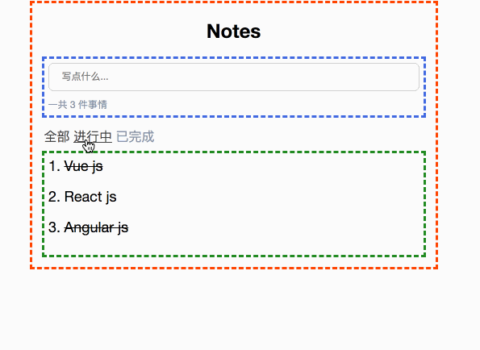

# 前端微服务

### 什么是前端微服务
    
前端是2016年底首次出现在[ThoughtWorks Technology Radar](https://www.thoughtworks.com/radar/techniques/micro-frontends)
将微服务的概念扩展到前端。用于构建一个功能丰富且功能强大的浏览器应用程序,就是现在流行的单页面应该SPA，一般的SPA应用会随着时间业务的增长前端层会越来越大且难以维护。

前端微服务是将网站或web应用程序分成一个个独立的功能组合。每个组合都可以由不同的团队，框架等来实现。例如一个网站可以由Vue，React,Angluar三个前端框架来组成。

### 前端微服务理念
- 技术不限定
    每个服务都可以由不同的框架来实现.由自定义元素来实现
- 隔离团队代码
    即使所有团队使用相同的框架，也不要共享运行时。构建自包含的独立应用程序。不要依赖共享状态或全局变量。
- 建立团队前缀
    在尚未实现隔离的情况下，就命名约定达成一致。命名空间CSS，事件，本地存储和cookie，以避免冲突。
- 持自定义API上的本机浏览器功能
    使用浏览器事件进行通信，而不是构建全局PubSub系统。如果您真的需要构建跨团队API，请尽量保持简单
- 构建弹性站点
    即使JavaScript失败或尚未执行，您的功能也应该很有用。使用通用渲染和渐进增强来提高性能。

###  自定义元素
自定义元素（Web Components Spec的互操作性方面）是在浏览器中集成的良好原语。每个团队建立他们的组件使用他们所选择的网络技术，并把它包装自定义元素中（如`<order-minicart></order-minicart>`。此特定元素的DOM规范（标记名称，属性和事件）充当其他团队的合同或公共API。优点是他们可以使用组件及其功能，而无需了解实现。他们只需要能够与DOM交互。

### 页面组成
除了在不同框架本身编写的代码的客户端和服务器端集成之外，还有隔离js的机制，避免css冲突，根据需要加载资源，在团队之间共享公共资源，处理数据获取并考虑用户的良好加载状态。

### 基础原型
下面是一个TODOS 的示例;

所有HTML都是使用纯JavaScript和ES6模板字符串生成的客户端，没有依赖项。代码使用简单的状态/标记分离，并在每次更改时重新呈现整个HTML客户端 - 没有花哨的DOM差异，现在也没有通用渲染。也没有团队分离 - 代码写在一个js / css文件中。

[浏览器打开](./0-model-store/) & [查看代码]()
