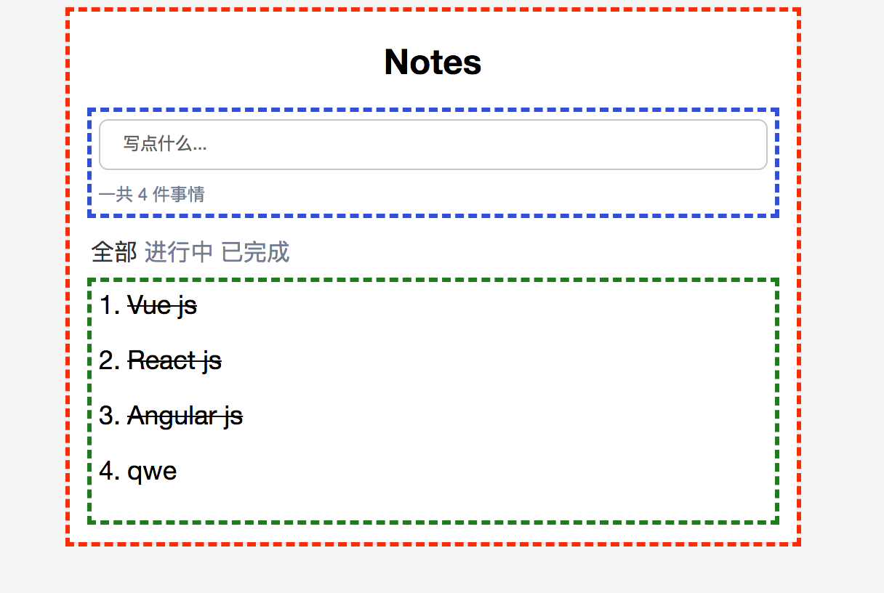

# 前端微服务

### 什么是前端微服务
    
前端是2016年底首次出现在[ThoughtWorks Technology Radar](https://www.thoughtworks.com/radar/techniques/micro-frontends)
将微服务的概念扩展到前端。用于构建一个功能丰富且功能强大的浏览器应用程序,就是现在流行的单页面应该SPA，一般的SPA应用会随着时间业务的增长前端层会越来越大且难以维护。

前端微服务是将网站或web应用程序分成一个个独立的功能组合。每个组合都可以由不同的团队，框架等来实现。例如一个网站可以由Vue，React,Angluar三个前端框架来组成。

### 前端微服务理念
- 技术不限定
    每个服务都可以由不同的框架来实现.由自定义元素来实现
- 隔离团队代码
    即使所有团队使用相同的框架，也不要共享运行时。构建自包含的独立应用程序。不要依赖共享状态或全局变量。
- 建立团队前缀
    在尚未实现隔离的情况下，就命名约定达成一致。命名空间CSS，事件，本地存储和cookie，以避免冲突。
- 持自定义API上的本机浏览器功能
    使用浏览器事件进行通信，而不是构建全局PubSub系统。如果您真的需要构建跨团队API，请尽量保持简单
- 构建弹性站点
    即使JavaScript失败或尚未执行，您的功能也应该很有用。使用通用渲染和渐进增强来提高性能。

###  自定义元素
自定义元素（Web Components Spec的互操作性方面）是在浏览器中集成的良好原语。每个团队建立他们的组件使用他们所选择的网络技术，并把它包装自定义元素中（如`<order-minicart></order-minicart>`。此特定元素的DOM规范（标记名称，属性和事件）充当其他团队的合同或公共API。优点是他们可以使用组件及其功能，而无需了解实现。他们只需要能够与DOM交互。

### 页面组成
除了在不同框架本身编写的代码的客户端和服务器端集成之外，还有隔离js的机制，避免css冲突，根据需要加载资源，在团队之间共享公共资源，处理数据获取并考虑用户的良好加载状态。

### 基础原型
下面是一个TODOS 的示例;

记录事件 并在三种状态中切换，添加，完成和删除功能


[浏览器打开](https://reborn233.github.io/frontends/0-model-store/) & [查看代码](./0-model-store/)

所有HTML都是使用纯JavaScript和ES6模板字符串生成的客户端，没有依赖项。代码使用简单的状态/标记分离，并在每次更改时重新呈现整个HTML客户端 - 没有花哨的DOM差异，现在也没有通用渲染。也没有团队分离 - 代码写在一个js / css文件中。

### 客户整合
在此示例中，页面被拆分为由三个团队拥有的单独组件/片段。Team Blue（蓝色）现在负责输入添加事情。Team Green（绿色）展示所在状态下的事情列表。页面本身由Team Red（红色）一个切换状态的Tabs。



[浏览器打开](https://reborn233.github.io/frontends/1-composition-client-only/) & [查看代码](./1-composition-client-only/)

### 如何创建自定义元素

以示例中的input为例。简单的添加`<blue-form></blue-form>`标记到html中。
需要为`blue-form`在页面上注册元素

```javascript
class BlueForm extends HTMLElement{
    constructor(){
        super()
        this.innerHTML =  `
        <form id="form" class="item-blue">
          <input id="input" type="text" placeholder="写点什么...">
          <p class="hint">一共 ${len} 件事情</p>
        </form>
      `; 
    }

    disconnectedCallback(){...}
};

window.customElements.define('blue-form',BlueForm);
```
现在，每次浏览器遇到新`blue-form`标记时，都会调用构造函数。this是对自定义元素的根DOM节点的引用。所有属性和一个标准的DOM元素的方法等innerHTML或getAttribute()可被使用。

在命名元素时，规范定义的唯一要求是名称必须包含短划线（ - ）以保持与即将推出的新HTML标记的兼容性。在即将到来的示例中，使用命名约定[team_color]-[feature]。团队名称空间可以防止冲突。

在`disconnectedCallback`旧元素被同步调用提供的元素与收拾东西像事件侦听器的机会。之后调用constructor新创建的元素。

Custom Element可以实现`attributeChangedCallback`并指定`observedAttributes`触发此回调。

为避免重复，`render()`引入了一个从`constructor`和调用的方法`attributeChangedCallback`。此方法收集所需数据，`innerHTML`收集新标记。当决定使用自定义元素中更复杂的模板引擎或框架时，这就是其初始化代码所在的位置。

### 浏览器支持
上面的示例使用了`Chrome`，`Safari`和`Opera`目前支持的`Custom Element V1 Spec `。但是使用[document-register-element](https://github.com/WebReflection/document-register-element)，可以在所有浏览器中使用轻量且经过实战考验的polyfill。在幕后，它使用广泛支持的 Mutation Observer API，因此在后台没有看到hacky DOM树。

### 框架兼容性
由于自定义元素是Web标准，因此所有主要的JavaScript框架（如Angular，React，Preact，Vue或Hyperapp）都支持它们。但是当你了解细节时，在某些框架中仍然存在一些实现问题。

### 父子/兄弟通信
在本示例中`input`输入并回车添加事情后,对应的列表应该刷新。

简洁的方法是使用PubSub机制，其中组件可以发布消息，而其他组件可以订阅特定主题。幸运的是，浏览器内置了此功能。

例如`click`,`select`或`mouseover`。除了这些之外，还有创建高级别的事件`new CustomEvent(...)`。事件始终与创建/分派的DOM节点相关联。大多数原生活动也有冒泡。这使得可以监听DOM的特定子树上的所有事件。如果要监听页面上的所有事件，请将事件侦听器附加到window元素。
以下是`blue:form:submit`的创建方式 先订阅事件

```javascript
class GreenNotes extends HTMLElement {

    connectedCallback() {
      this.refresh = this.refresh.bind(this);
      this.log('connected');
      this.render();
      window.addEventListener('blue:form:submit', this.refresh);
    }
    refresh() {
      this.log('input 提交事件 "blue:form:submit"');
      this.render();
    }
    render() {
      const noData = `<p class="center">no data</p>`
      this.innerHTML = `
        <div class="tab-container item-green">
          <ol>
            ${filterData().length === 0 ? noData:filterData().map(this.renderNote).join('')}
          </ol>
        </div>
      `;
    }
    renderNote(note) {
      const del = note.finished ? 'del' : '';
      return `
        <li name="${note.id}">
          <span class="content ${del}">${note.content}</span>
          <span class="btn">删除</span>
        </li>
      `;
    }
    disconnectedCallback() {
      window.removeEventListener('blue:form:submit', this.refresh);
      this.log('disconnected');
    }
  }
```

当form表单submit时,`window`会收到通知

```javascript
class BlueForm extends HTMLElement {
    connectedCallback() {
      this.handleInput = this.handleInput.bind(this);
      this.log('connected');
      this.render();
    }
    render() {
      const len = note.notes.length;
      this.innerHTML =  `
        <form id="form" class="item-blue">
          <input id="input" type="text" placeholder="写点什么...">
          <p class="hint">一共 ${len} 件事情</p>
        </form>
      `;
      document.getElementById('form').addEventListener('submit', this.handleInput);
    }
    handleInput(e){
      e.preventDefault();
      [...]
      this.dispatchEvent(new CustomEvent('blue:form:submit', {
        bubbles: true,
      }));
      [...]
    }
    disconnectedCallback() {
      document.getElementById('form').removeEventListener('submit', this.handleInput);
      this.log('disconnected');
    }
  }
```

### 服务端渲染
自定义元素非常适合在浏览器中集成组件。但是，当构建可在Web上访问的站点时，初始加载性能很可能很重要，并且用户将看到白屏，直到所有js框架被下载并执行。此外，如果JavaScript失败或被阻止。
在服务器上呈现核心内容的能力是关键。遗憾的是，Web组件规范根本没有讨论服务器渲染。没有JavaScript，没有自定义元素

### 自定义元素+服务器端渲染
要使服务器呈现工作，前面的示例将被重构。每个团队都有自己的快速服务器，render()也可以通过URL访问自定义元素的方法。

    http://127.0.0.1:3000/green-notes?status=all

自定义元素标记名称用作路径名称 - 属性成为查询参数。现在有一种方法来服务器呈现每个组件的内容。结合`<green-notes>`-Custom Elements，可以实现与Universal Web Component。
```
<green-notes status="all">
    <!--#include virtual="/green-notes?status=all" -->
</green-notes>
```

该`#include`注释是[Server Side Includes](https://en.wikipedia.org/wiki/Server_Side_Includes)的一部分，这是大多数Web服务器中可用的功能。

Web服务器发送完整的网页浏览器。nginx中的配置如下所示：

```
upstream team_blue {
  server team_blue:3001;
}

upstream team_green {
  server team_green:3002;
}

upstream team_red {
  server team_red:3003;
}

log_format compact '$request $status - $bytes_sent';
access_log off;

server {
  listen 3000;

  access_log /var/log/nginx/access.log compact;
  ssi on;

  location /blue {
    proxy_pass  http://team_blue;
  }

  location /green {
    proxy_pass  http://team_green;
  }

  location /red {
    proxy_pass  http://team_red;
  }

  location /common {
    root /usr/share/nginx/html;
  }

  location / {
    proxy_pass  http://team_red;
  }
}

```

该指令`ssi: on`;启用S​​SI功能，`upstream`并`location`为每个团队添加一个和块，以确保所有以＃开头的URL `/blue`将被路由到正确的应用程序（`team_blue:3001`）。此外，/路线映射到团队红色。

下面是禁用JavaScript的浏览器中显示不同状态的列表


可以克隆此示例在本地计算机上浏览。需要安装[Docker Compose](https://docs.docker.com/compose/install/)

```
git clone https://github.com/Reborn233/frontends.git
cd frontends/2-composition-universal
docker-compose up --build
```

Docker然后在端口3000上启动nginx并为每个团队构建node.js映像。当您在浏览器中打开http://127.0.0.1:3000/浏览该应用。

更改`src`文件会映射到各个容器，当改动代码时，节点应用会自动重启。
更改`nginx.conf`需要重启`docker-compose`才能产生效果。

### 数据获取和加载状态
SSI / ESI方法的缺点是，最慢的片段决定了整个页面的响应时间。因此，当片段的响应可以被缓存时，这是很好的。对于生产成本高且难以缓存的片段，通常最好将它们从初始渲染中排除。它们可以在浏览器中异步加载。

### 最后看法

前端微服务是我之前看到的一个帖子里面讲到的，感到很有趣就实践了一下。参考了[micro-frontends](https://github.com/neuland/micro-frontends)这位大神的一个购物车应用。
自己实践了一个TODOS应用。十分有意思的一个技术。虽然目前不会使用到工作中 ，但记录下来学习一下。
